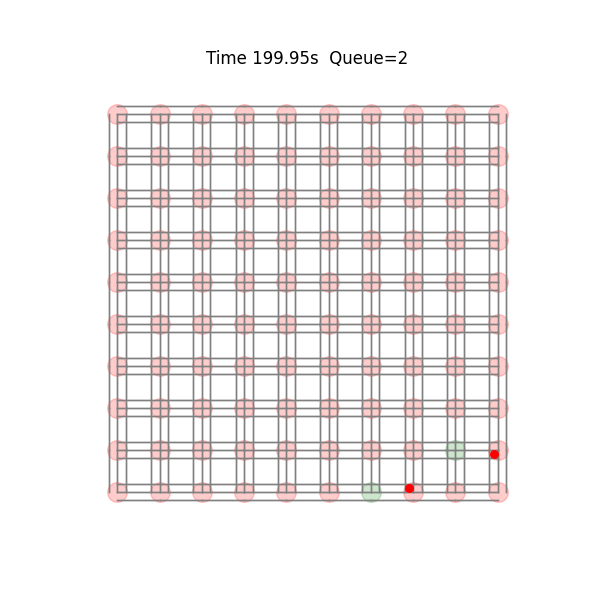

# Smart-City Intersection Optimization via Priority Bidding Mechanisms

## Overview

Smart-City Intersection Optimization via Bid-Driven Signal Parameterization is a collaborative effort between the Illinois Mathematics and Science Academy (IMSA) and Southern Illinois University, Carbondale (SIUC). It provides the Priority Bidding Mechanism (PBM) for adaptive traffic signal control. Balancing efficiency, speed, and performance, PBM improves upon current algorithms for traffic signal control.

<div align="center">
  
</div>
<div align="center">
  Above is an example simulation of 10x10 grid with 2 vehicles.
</div>

## 🚀 Getting Started

### Prerequisites

* Python 3.8 or higher
* Install dependencies:

  ```bash
  pip install -r requirements.txt
  ```

### Clone & Navigate

```bash
git clone https://github.com/LakshRP/Priority-Bidding-Mechanism-for-Smart-Intersections.git
cd Priority-Bidding-Mechanism-for-Smart-Intersections
```

### Run Core Experiments

```bash
python code/main.py
```

This produces (in `results/`):

* **Experiment 1: PBM vs. Fixed-Time**

  * `exp1_mean_q_pbm.csv`
  * `exp1_mean_q_fix.csv`
  * `exp1_queue_length.png`

* **Experiment 2: Runtime Scaling**

  * `exp2_vehicle_counts.csv`
  * `exp2_avg_times.csv`
  * `exp2_std_times.csv`
  * `exp2_runtime_scaling.png`

---

## 🔍 Sensitivity Analyses

```bash
python code/analytics.py grid_size      --sizes 2 4 6 8   --nveh 20 --duration 200 --trials 5
python code/analytics.py vehicle_count --grid 4            --counts 10 50 100 200 --duration 200 --trials 5
python code/analytics.py cycle_count   --grid 4 --nveh 20 --cycles 50 100 200 500 --duration 50 --trials 3
```

Outputs saved under `results/analytics/` (CSV summaries and `.png` plots).

---

## 📋 Requirements

```text
numpy>=1.21
matplotlib>=3.4
networkx>=2.6
```

---

## 📝 Paper & Documentation

* **Manuscript:**
  `coming soon`


---

## 📄 License

This project is released under the **MIT License**. See [LICENSE](LICENSE) for details.

---

## 👥 Authors
**Laksh Patel (IMSA)**, **Soham Batra (IMSA)**, **Dr. Anas Alsobeh (SIUC)**, and **Dr. Thomas Imboden (SIUC)**
